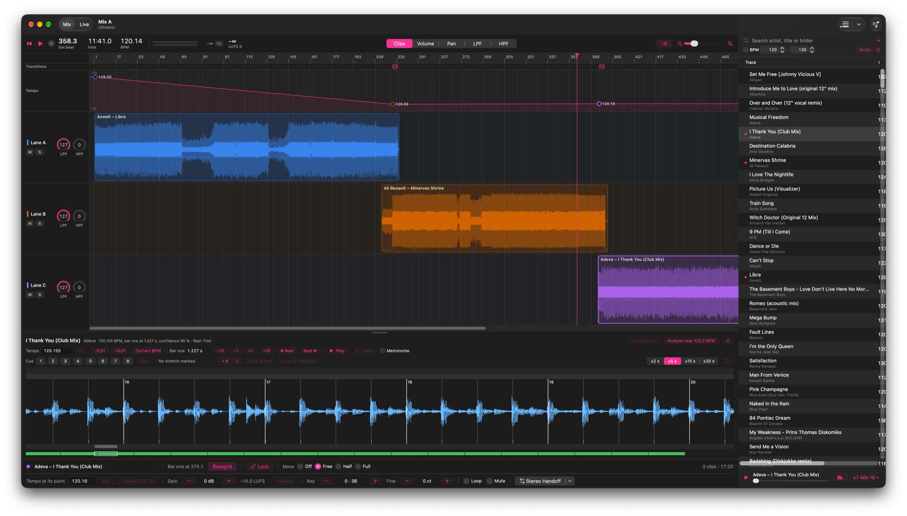

# Ultramix

A native macOS DJ mix editor: build a complete mix on a beat-based timeline
before the party, hear every transition while you shape it, and bounce the
finished set to WAV or MP3.



Swift, SwiftUI and AVFoundation, Apple Silicon only.

```
No SignUp
No User Profiling
No Tracking
No Cookie Banners
No Terms & Conditions
No Paywalls
No Ads
No Data Mining
```

Your files, your machine. Ultramix opens no network connection of any kind,
has no account, no telemetry and no plugins, and never writes to a song file
unless you ask it to.

## What it does

- **Library** — import files or whole folders (MP3, AAC/M4A, WAV, AIFF,
  FLAC). Every track is analysed in the background for tempo, beatgrid and
  first downbeat, and gets a peak/RMS waveform.
- **Two beat analysers** — Settings › Beat Detection. *Beat This!*, the
  default, adds a neural network (small model, 8 MB, run on the Mac's own
  Neural Engine) that decides the tempo, whether a beat is on or off the
  beat and which beat is the one; the Ultramix kick fit then places the
  lines. *Ultramix* is that kick fit on its own. The choice applies to songs
  imported afterwards and to Analyse Again, and no song already analysed
  changes.
- **BPM into the files** — File › Write BPM to All Files puts the measured
  (or corrected) tempo into the songs themselves: a TBPM frame in an MP3's
  ID3 tag, to two decimals, and a `tmpo` atom in an M4A, whole numbers as
  that format allows. Every other tag in the file is left exactly as it was.
  *Write BPM to Original Files…* does the same to the files the songs were
  imported from, once you point it at the folder they live in, and the
  import panel can tick the originals along as each track is analysed.
  Only on command, never on its own.
- **BPM scanner** — File › Scan Files for BPM… opens a window of its own.
  Drop songs, folders or a selection straight out of Music on it and their
  tempo is measured and written into their own tags, where they lie: nothing
  is copied, no library is involved, and no working directory is needed. The
  list sorts by tempo, which is what picking records out of a playlist wants.
  A song that already carries a BPM is listed with it and skipped, unless
  you ask for it to be measured again. Double-click a song to correct its
  tempo by hand (see *Correct BPM*); the tag is rewritten.
- **Correct BPM** — for a tempo the analysis got an octave wrong (174 where
  the song is 87). Play the song, tap along on every beat for a few seconds,
  and the measured tempo is offered at half, as it is and at double, with
  the one nearest your taps preselected; ÷2 and ×2 step through by hand.
  In the beatgrid editor, the library's context menu and the BPM scanner.
- **Beatgrid editor** — a pane under the timeline, above the clip rows,
  opened for one track and draggable taller, with the mix still in sight
  (the clip bar's **Beatgrid** opens the clip or library track picked last,
  and pressed again folds it); **E** or the Beatgrid button folds it to a
  one-line bar and back without losing anything. When analysis needs help:
  manual BPM, Correct BPM, click a kick to set bar one, shift the downbeat
  by a beat. Corrections are yours; re-analysis never overwrites them. Its
  waveform scrolls with the bar under it and shows a fixed span — ±2, ±5,
  ±15 or ±30 seconds — so a beat and a phrase are both reachable and every
  step draws a known amount. **Play** stops the timeline; with **Cycle** it
  goes round the marked stretch, and ← → / ⌥← ⌥→ move its ends a beat
  (⇧: a bar) while it plays.
- **Cue points** — up to eight marks per song, set with **1**…**8** where the
  song is, pressed again to go there, **⌥1**…**⌥8** to take one away. They
  say where the next record comes in: **At Cue: Beatmix N** in the library's
  right-click and ⏎ menus starts the beatmix at the next cue of the record
  being mixed out of, on that record's nearest bar line. Saved with the track,
  never written by an analyser.
- **Loops** — drag across the waveform to mark a stretch (**I** and **O** set
  its ends); **Loop at End** and **Loop at Playhead** put it into the mix as a
  looping clip, repeated as often as the **×** menu says, with the beatmix the
  toolbar is set to. The loop is an ordinary clip afterwards: trim it, draw on
  it, replace its transition.
- **Timeline** — three stereo lanes. Clips are pinned by their first
  downbeat and snap to bar lines, so bars stay aligned whatever the intros
  hold. Trim, split, duplicate, loop and mute clips; everything is undoable.
  The mouse wheel zooms around the pointer (⇧ scrolls sideways), as do a
  pinch and **+** / **−**.
- **One tempo map** — each clip sets the tempo the mix reaches at its tempo
  point, and the mix ramps between them. The tempo changes only on beat
  boundaries, where the transient hides it, and every clip follows it through
  pitch-preserving time-stretching.
- **Master tempo** — type a tempo at the head of the tempo strip and click
  the lock: the whole mix plays at that one tempo, and every tempo point sits
  on it; dragging any point moves the master. Unlock, and each point has its
  own tempo back - the lock never overwrites them.
- **Key shift** — **Key − / +** in the clip bar plays a clip up to six
  semitones higher or lower, showing the Camelot code of the key it then plays
  in, and **Fine − / +** tunes it in steps of 5 cents, up to 50 either way, for
  a record a little off concert pitch. The length, the beatgrid and every
  curve stay exactly as they are; only the pitch moves. Each shift is rendered
  once in the background, a second or two per song, with a Swift port of
  Signalsmith Stretch, and kept in the cache; until it is ready the clip plays
  unshifted, and a bounce waits for it.
- **Stems** — the arrow beside M and S expands a lane: under each clip a row
  each for its drums, bass, vocals and everything else, with the stem's own
  waveform. Every automation tool works in a stem row as in the clip's own -
  a fade on the vocals alone, a low-pass on the drums, pan on the bass - and
  picked on a stem row, Gain and Mute (and **M**) work on that stem; the
  clip's own row works on the four together. Where the clip sits, its length,
  tempo and key stay the clip's, so the stems always add up to the song. A
  song is separated only when you ask - a click in a clip's stem rows, or
  right-click › Separate Stems - with Demucs v4 as a Core ML model, a few
  seconds a song, once, and the stems are kept in the working directory. A
  bounce separates what it needs first.
- **Transition bars** — every transition and beatmix gets a bar in a strip
  under the ruler, like a cycle range in a DAW. Drag its ends or the whole bar
  and the transition is written again there; right-click for another style;
  delete it and every point inside its range goes, on every lane.
- **Automation** — volume (fader taper), pan, low-pass and high-pass on each
  clip, as exact nodes or as drawn step/sine/triangle gestures. **Rec**
  records the lane knobs into the clip under the playhead while the mix
  plays (Touch).
- **Lane knobs** — two knobs in every lane header, each a low-pass,
  high-pass, pan or volume, turned by mouse or by a MIDI controller
  (Settings › MIDI Controller: pick the inputs, Learn a CC per knob). They
  act on playback in the Mix and Live tabs, on top of the automation; a
  bounce never hears them and a mix never stores them.
- **Live** — a tab of its own beside the mix (⌘1 / ⌘2) plays a set on the
  same timeline, with the same beatmixes, that never piles anything up: at
  most three clips (the one playing and the ones waiting), and a bar after a
  clip ends it is let go of and the set moves back by whole bars. The tempo
  map takes the clock time of that point as its origin, so the sound does not
  change by a sample. An empty lane drops to the bottom the moment it is
  empty and the others move up. The set plays on while the mix is edited, and
  is never saved. **Auto** keeps it from running empty: whenever nothing
  waits, the next track of the library list as shown goes in with a
  Beatmix 4, so there is no pause (optionally in BPM order). Adding while the
  set plays never changes the tempo of what has already played.
- **Bounce** — the same renderer as playback, faster than real time, to
  16-bit WAV with dither or 320 kbps MP3, with an optional look-ahead
  mastering limiter.

## Working directory

Ultramix keeps everything for your mixes in one folder you choose — for
example on an external drive. It asks which one to use every time it starts
(the last one is preselected), and **File › Switch Working Directory…**
changes it later.

```
<Working directory>/
  Ultramix Library.json   the library: tracks, analysis, corrections
  Audio/                  copies of the imported songs
  Mixes/                  saved mixes (.ultramix)
  Bounces/                WAV and MP3 exports
  Stems/                  separated stems (Apple Lossless), kept
  Cache/                  decoded audio, key shifts, waveforms — safe to delete
```

Imported songs are **copied** into `Audio/`, and every path is stored
relative to the folder, so the same drive works on another Mac.
If your songs already live on the same drive, switch off **Settings ›
Library › Copy imported songs into the working directory** (or untick it in
the import panel): songs outside the working directory are then read where
they lie. They must stay there — a song moved on the same drive is still
found, one deleted or renamed elsewhere is not — and the permission to read
them belongs to this Mac, so on another Mac only copied songs play. Each
working directory has its own library; app settings (appearance, zoom,
bounce settings) stay on the Mac.

The decoded audio in `Cache/` is about 10 MB per minute of music. It is kept
under a size limit (**Settings › Audio Cache**, 5 GB by default): above it,
the songs used longest ago give their decoded audio back, and it is decoded
again — in under a second — when a mix, the live set or the library needs
it. Songs in the open mix and live set are always kept. A clip with a key
shift adds a rendered copy of its song, the same size; it counts towards the
limit with that song and goes with it.

A separated song keeps its drums, bass and vocals in `Stems/` for good -
about 10 MB per minute of music, the rest being the song less those three -
so it is separated once. To play, they are decoded into the cache like the
song, three times its size, and given back under the limit with it.
Right-click › Delete Stems frees the space.

On a drive with room, **Settings › Library › Keep every song decoded** takes
the limit away: every song is decoded once and kept, so nothing is decoded and
nothing is given back while the music plays. Switching it on decodes the whole
library in one go, with a progress bar and a Stop, and says first how many
songs and how many gigabytes that is. The song files are never touched — the
decoded audio is a bare stream of samples and carries no tags — and switching
it off puts the chosen size back.

**Eject the drive before unplugging it.** Ultramix closes the working
directory cleanly when the drive is ejected. Pulling the cable without
ejecting while a mix is open can crash the app, because the decoded audio
is read straight from the drive.

## Privacy

Ultramix is an offline application. It has no network code, contacts no
server, collects no analytics and stores nothing outside your Mac and the
working directory you pick.

This is enforced, not just promised: the app runs in the macOS sandbox and
is built without the network entitlement, so it *cannot* open an outgoing
connection even if it tried. Its entitlements are the sandbox itself,
read-write access to the files and folders you pick, and read-only access to
your music folder — nothing else.

App settings live in the normal macOS preferences for the app; the library,
your mixes and the cache live in the working directory you chose. Song files
are only ever written when you ask for a BPM to be written into them, and
then only the BPM tag changes.

A saved mix (`.ultramix`) is plain JSON and carries no security-scoped
bookmarks, so passing one to somebody else hands over no hidden trace of
your Mac. It does name the songs it uses: paths relative to the working
directory for copied songs, and the full path for a song you chose to keep
where it lies (**Settings › Library › Copy imported songs**, off). If a mix
is going to leave your machine, import with copying on.

## Build

Requirements: macOS 26.5, Xcode 26.

```
./build_dmg.sh                # Release build → /Applications → .dmg
./build_dmg.sh --no-install   # build and package only
Verification/run.sh           # the verification harness (-O for Release)
```

There is no test target. `Verification/main.swift` is compiled with the
model, analysis, engine and export sources and checks them against values
worked out by hand.

The build is signed ad-hoc, without a developer account, so a `.dmg` passed
to another Mac is quarantined by Gatekeeper. Open it once with right-click ›
Open, or remove the flag with
`xattr -d com.apple.quarantine /Applications/Ultramix.app`. Building from
source on your own Mac avoids this.

## Tools

`Tools/music-tags.py` makes Music show what is in the files. Music keeps its
own database and does not read a song again once it has read it, so a tempo
written afterwards stays invisible there; the script compares every file
track against its file and then asks Music to `refresh` the ones that are out
of date. Run it without arguments to see what would change, with `--refresh`
to do it, and with `--refresh --all` to have Music read every file again.

`Tools/convert-demucs.py` makes the stem model: it converts Demucs's
`htdemucs` weights to Core ML - the network alone, the spectrum and the
chunking being Swift's - checks the result against PyTorch, and writes the
reference values the verification harness holds the Swift side to. It needs
a Python environment with PyTorch, coremltools and Demucs; the header says
which versions.

## License

Ultramix is © 2026 T'Zorr, MIT — see [LICENSE](LICENSE).

It contains four third-party components, all of which keep their own
licences and attributions:

- **LAME** (`libmp3lame`), LGPL-2.0, used for MP3 export.
- **Beat This!** (`small0` weights) as a Core ML model, MIT, used by the
  optional neural beat analyser.
- **Signalsmith Stretch** and the parts of **Signalsmith Linear** it runs on,
  MIT, ported to Swift for the key shift.
- **Demucs v4** (`htdemucs` weights, Meta) as a Core ML model, MIT, used to
  separate songs into stems.

The full details, copyright holders and licence texts are in
[THIRD_PARTY_NOTICES.md](THIRD_PARTY_NOTICES.md). Keep that file with the
source and with any binary you pass on.

## Contact

T'Zorr — <TZorr@gmx.de>
